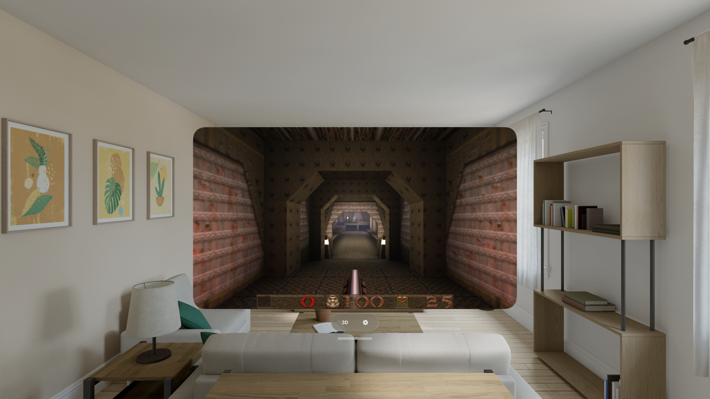

# vkQuake for iPhone & Apple Vision Pro

Play **Quake** on your iPhone and Apple Vision Pro — the full campaign, the mission
packs, custom mods, and a stereoscopic **3D mode** on Vision Pro that puts the game
on a floating screen in your room with real depth. 100% vibe coded with lots of passion
and attention to detail.

Built on [vkQuake](https://github.com/Novum/vkQuake), the Vulkan-powered engine, running
natively through Metal.

<p align="center">
  
</p>

---

## Install

**Add the SideStore source** — the easiest path, and vkQuake auto-updates when new versions ship:

| Device | Source URL |
| --- | --- |
| iPhone / iPad | `https://raw.githubusercontent.com/rebelancap/quake-ports/main/apps-ios.json` |
| Apple Vision Pro | `https://raw.githubusercontent.com/rebelancap/quake-ports/main/apps-visionos.json` |

In [SideStore](https://sidestore.io) / [AltStore](https://altstore.io): *Sources → **+** → paste the URL*, then
install vkQuake. These are shared sources — they also carry Quake II and Quake III.

On **Apple Vision Pro**, first install SideStore onto the headset with
[iloader](https://github.com/rebelancap/iloader/releases#release-visionos) (SideStore/AltStore can't be
installed on visionOS the usual way — iloader is what gets SideStore there). Then add the source in SideStore
exactly as above. No Xcode or Dev Strap required.

**Prefer a manual install?** Download `vkQuake-*-iOS.ipa` / `vkQuake-*-visionOS.ipa` from the
[latest release](../../releases/latest) and install it through SideStore/AltStore yourself (iPhone / iPad can
also use [Sideloadly](https://sideloadly.io)).

Then **add your Quake files** (see below) at first launch, or via **Files** → *On My iPhone / Vision Pro →
vkQuake* → pick your `rerelease` folder (`id1` + `QuakeEX.kpf`).

## You bring the game

vkQuake ships with **no game content** — you must own Quake and provide your own files.
Copy one of these into the app's folder:

- **Quake (2021 re-release)** — Steam/GOG. Highly recommended, especially for Vision Pro 3D mode. 
  The enhanced models, music, and the bonus  episodes *Dimension of the Past* and *Dimension of the Machine* all work.
- **Original Quake** — `pak0.pak` + `pak1.pak`.

The classic mission packs (*Scourge of Armagon*, *Dissolution of Eternity*) and QuakeC
mods drop in the same way — put each in its own folder (e.g. `hipnotic`, `rogue`, or a
mod like `ad` for Arcane Dimensions) and it appears in the in-game Mods menu.

## Features

- Full single-player campaign with saves, both mission packs, and the re-release episodes
- **QuakeC mods** — drop a mod folder in and launch it from a generated menu (Arcane
  Dimensions, Copper, Alkaline, …)
- Music, all sound, demos, and the full menu/console by touch or controller
- **Game controllers** with a sane default layout; on-screen touch sticks + gyro aim
- 60 / 120 Hz (ProMotion), in-app settings that persist
- **Apple Vision Pro:** free-resizing 2D window, plus a **3D mode** — the game on a
  world-locked stereoscopic panel, controller-aimed, with live-tunable screen size,
  distance, depth, and room dimming

## Requirements

- iPhone/iPad on **iOS 16+**, or **Apple Vision Pro** (visionOS 2+)
- A sideloading tool (SideStore / AltStore) ([iloader](https://github.com/rebelancap/iloader/releases#release-visionos) for visionOS)
- Your own Quake game files

## FAQ

**Which Quake data should I use?** The 2021 re-release if you have it — you get the extra
episodes and enhanced content. Original `pak0`/`pak1` also works.

**Is any game content included?** No. You supply your own files; nothing copyrighted ships
with the app.

**Multiplayer?** Direct connect over NetQuake is supported (LAN and internet servers).

**The app stopped launching after about a week?** Apps sideloaded with a free Apple
account expire after 7 days (paid developer accounts last a year). SideStore/iloader
refresh them automatically in the background — open the sideloading app and let it
re-sign.

---

## Building from source

Requires macOS with Xcode, plus `xcodegen` and `cmake` (`brew install xcodegen cmake`).

```sh
scripts/build-ios-deps.sh        # SDL3 + MoltenVK + codecs (once)
scripts/build-ios.sh             # engine + signed iOS app
scripts/build-visionos-deps.sh   # visionOS dependencies (once)
scripts/build-visionos.sh        # engine + signed visionOS app
```

Upstream vkQuake is vendored unmodified and pinned by commit; every local change is a
reviewable patch in `patches/`, applied by `scripts/sync-overlay.sh`. A frame-level
architecture map is in `docs/upstream-map.md`.

## Credits & license

- [vkQuake](https://github.com/Novum/vkQuake) by Axel Gneiting and contributors
- QUAKE © id Software
- Licensed under the **GNU GPL v2** (see `COPYING`), matching upstream vkQuake.
